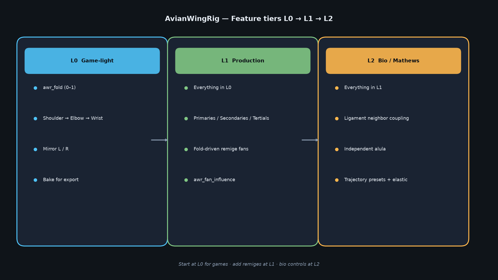
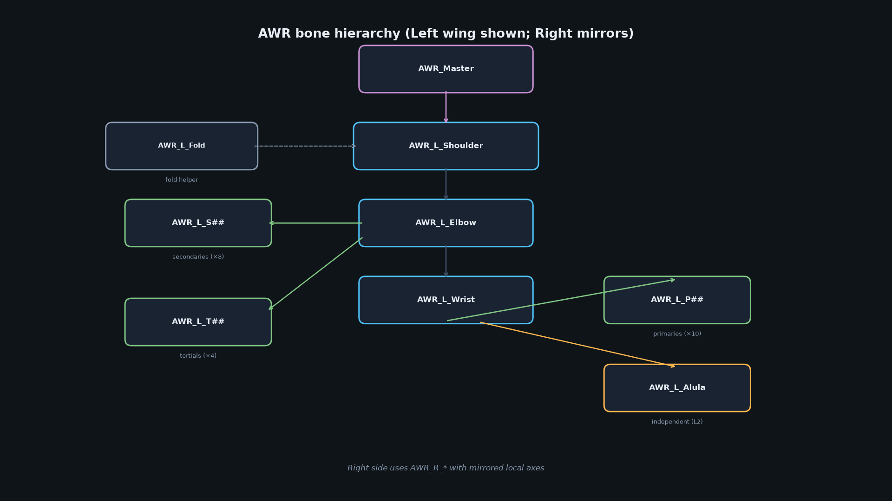
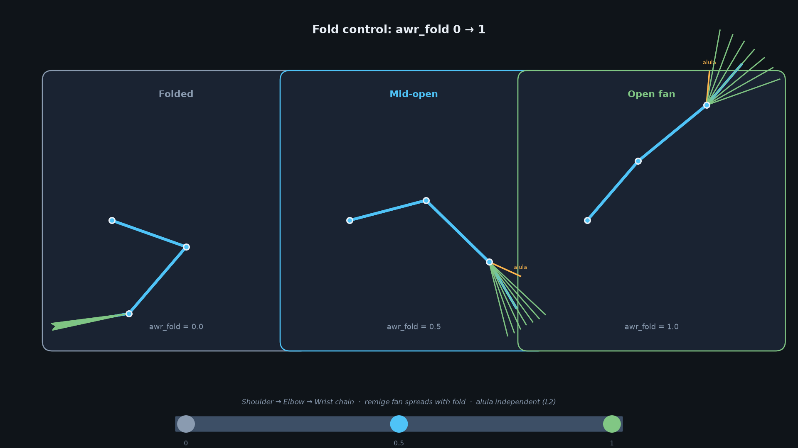

# AvianWingRig

<!-- badges (optional placeholders) -->
[](LICENSE)
[](https://www.blender.org/)
[](https://www.python.org/)

Open **Blender 4.x** addon that turns **Laura Mathews–style avian wing mimicry** into animation-ready rigs at three tiers.

**Unreal Engine 5 plugin** (separate repo): [hallower1980/avian-wing-rig-unreal](https://github.com/hallower1980/avian-wing-rig-unreal) — C++/Blueprint math library, component, Control Rig walkthrough. Same L0/L1/L2 naming and fold constants.

Inspired by Mathews’ magpie/phoenix mechanical wings (reciprocal skeleton, inter-feather ligaments, alula, elastic return) and biomechanics literature on elbow–wrist morphing trajectories.

Maintained by [hallower1980](https://github.com/hallower1980) / AvianWingRig contributors.

## Features by tier

| Tier | Name | What you get |
|------|------|----------------|
| **L0** | Game-light | Fold (0–1) + 3-joint chain, mirrored L/R, bake-ready |
| **L1** | Production | Remige banks (primaries / secondaries / tertials), fold-driven fans, tunable influence |
| **L2** | Bio / Mathews | Ligament neighbor coupling, independent alula, trajectory presets, elastic return bias |



*Figure: L0 → L1 → L2 feature stacks — start game-light, grow into bio-faithful controls.*

## Install (Blender 4.x)

1. Zip the `avian_wing_rig/` folder **or** copy it into your Blender addons directory:
   - Linux: `~/.config/blender/4.x/scripts/addons/avian_wing_rig/`
   - macOS: `~/Library/Application Support/Blender/4.x/scripts/addons/avian_wing_rig/`
   - Windows: `%APPDATA%\Blender Foundation\Blender\4.x\scripts\addons\avian_wing_rig\`
2. Blender → **Edit → Preferences → Add-ons** → search **Avian Wing Rig** → enable.
3. Open the **3D Viewport** sidebar (`N`) → tab **AvianWing**.

> The package root is the folder that contains `__init__.py` with `bl_info`. Do not zip the whole git repo unless you adjust the path.

## Quick start — L0 → L2

### Screenshots & diagrams



*Figure: Bone hierarchy — `AWR_Master` → shoulder → elbow → wrist → remiges / alula.*



*Figure: `awr_fold` from 0 (tucked) to 1 (open) drives the reciprocal chain and remige fan.*

### L0 (fold + flap chain)

1. Sidebar → Tier **L0 Game-light** → enable **Mirror L/R** → **Add Wing Rig**.
2. Drag **Fold** (0 = tucked, 1 = open) → **Set Fold**.
3. Inspect `AWR_Master` custom property `awr_fold`, or rotate shoulder for manual flap on top of drivers.
4. **Bake Constraints for Export** before FBX/glTF for games.

### L1 (remige fans)

1. Tier **L1 Production** → set **Fan Influence** → **Add Wing Rig**.
2. Set Fold — primaries (`AWR_L_P##`), secondaries (`_S##`), tertials (`_T##`) fan open together.
3. Tune `awr_fan_influence` on the master bone for softer/harder sheet open.

### L2 (ligaments, alula, trajectories)

1. Tier **L2 Bio/Mathews** → set ligament strength + elastic → **Add Wing Rig**.
2. **Alula** slider / **Toggle Alula** — independent thumb feathers on `AWR_L/R_Alula`.
3. Pick a **Trajectory** preset (Linkage / Constant Lift / Constant Stability) → **Apply Trajectory Preset**.
4. Elastic bias pulls effective fold toward rest (low-effort return analogue).

## Bone & property naming

- Skeleton: `AWR_L/R_Shoulder`, `_Elbow`, `_Wrist`
- Controls: `AWR_Master`, `AWR_L/R_Fold`
- Remiges: `AWR_L/R_P##`, `_S##`, `_T##`
- Alula: `AWR_L/R_Alula`
- Master props: `awr_fold`, `awr_alula`, `awr_tier`, `awr_trajectory`, `awr_elastic`, `awr_ligament_strength`, `awr_fan_influence`

## Documentation

| Doc | Contents |
|-----|----------|
| [`docs/MECHANICS.md`](docs/MECHANICS.md) | Mathews / biomechanics → rig features |
| [`docs/COMPARISON.md`](docs/COMPARISON.md) | vs Auto-Rig Pro, hand FK, UE marketplace packs |
| [`docs/UNREAL_CONTROL_RIG.md`](docs/UNREAL_CONTROL_RIG.md) | Step-by-step rebuild of L0–L2 in UE5 Control Rig |
| [`RESEARCH_BRIEF.md`](RESEARCH_BRIEF.md) | Source principles & literature |
| [`AGENTS.md`](AGENTS.md) | Conventions for future coding agents |

## Unreal Engine sibling

Runnable UE5.3+ plugin + walkthrough: **[avian-wing-rig-unreal](https://github.com/hallower1980/avian-wing-rig-unreal)**.

Legacy in-repo Control Rig notes remain in [`docs/UNREAL_CONTROL_RIG.md`](docs/UNREAL_CONTROL_RIG.md); prefer the sibling plugin README / `docs/WALKTHROUGH.md` for new work.

## Unreal roadmap (summary)

1. Export baked skeletal mesh + fold animation from Blender L0.
2. Rebuild fold float → shoulder/elbow/wrist in **Control Rig** (see `docs/UNREAL_CONTROL_RIG.md`).
3. Add remige banks as FK chains driven by the same fold float (L1).
4. Add alula control, neighbor lerp (ligament), and trajectory curves (L2).
5. Optional AnimBP: flap cycle × fold for flight locomotion.

## Tests

```bash
# No Blender required — syntax / import structure
python3 tests/test_syntax.py

# With Blender on PATH
blender --background --python tests/test_smoke_blender.py
```

See `tests/MANUAL_CHECKLIST.md` for a UI walkthrough.

## Contributing

Issues and pull requests are welcome on the public GitHub repo under [hallower1980](https://github.com/hallower1980).

- Keep **L0 solid** when extending L1/L2.
- Prefer inspectable drivers/constraints over opaque per-frame handlers.
- Update `README.md`, `docs/MECHANICS.md`, and related docs when mechanics change.
- See [`AGENTS.md`](AGENTS.md) for naming and tier contracts.

## License

MIT — see [`LICENSE`](LICENSE).

Copyright (c) 2026 AvianWingRig contributors.

Mechanical inspiration from Laura Mathews’ public wing demonstrations; biomechanics citations in the research brief. Not affiliated with or endorsed by those makers/authors.
